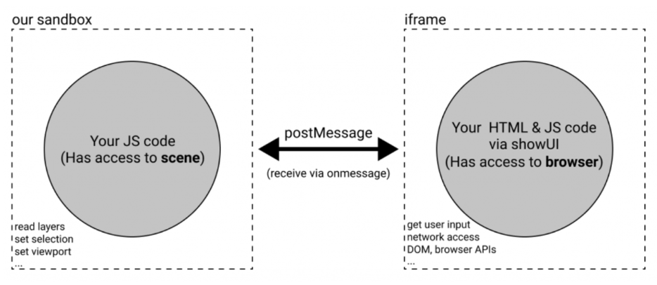
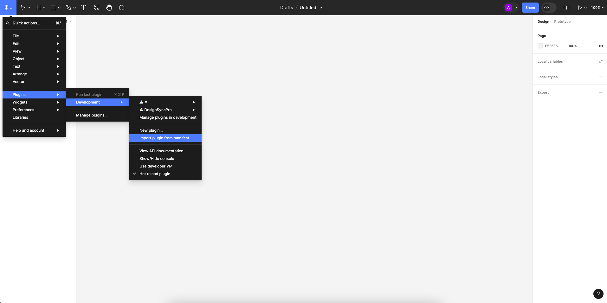
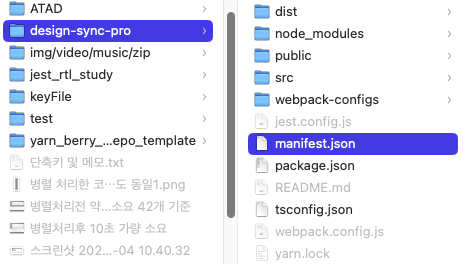
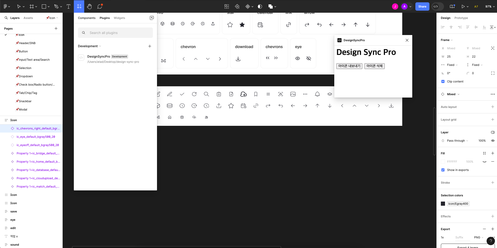

# Design Sync Pro

## Index

- [Introduction(소개)](##introduction)
- [Structure(구조)](#folder-structure)
- [Getting Started(시작하기)](#getting-started)
- [ETC(기타)](#etc)
- [Reference(참고)](#reference)

## Introduction

Design Sync Pro는 디자인 시스템을 쉽게 동기화 하기 위해 개발한 피그마 플러그인 입니다.

동작의 순서는 아래와 같습니다.

1. 피그마 플러그인을 실행합니다.
2. 피그마 플러그인에서 아이콘을 선택합니다.
3. 선택한 아이콘을 내보내기 합니다.
4. 내보낸 아이콘을 ATAD 레포지토리에 업로드 합니다.
5. 우선 현재 임시로 icon들이 저장되는 위치는 src/icons 폴더입니다.
6. Commit & Pull Request를 생성합니다.

이 후 개발자는 해당 Pull Request를 확인하고 Merge를 진행합니다.

## Structure



쉽게 피그마 플러그인은 두 계층에서 동작합니다.

sandbox와 iframe인데 여기서 sandbox(plugin 폴더)는 피그마 플러그인 관련 로직, 즉 비즈니스 로직 쪽과 관련이 있고, iframe(ui 폴더)은 우리가 보는 UI와 관련이 있습니다.

중요한 점은 sandbox에서는 브라우저 API는 호출하지 못하고 플러그인 API는 호출이 가능하다.

그리고 iframe에서는 브라우저 API는 호출되지만 플러그인 API는 호출이 불가능하다.

## Getting Started

첫 번째로 root 폴더에서 `yarn` 명령어를 통해 의존성을 설치합니다.
두 번째로 root 폴더에 .env 파일을 생성하고 아래에 변수 값들을 작성합니다.

```env
GITHUB_TOKEN={GITHUB TOKEN 토큰을 발급받아서 넣어주세요}
GITHUB_ORG_NAME={GITHUB ORG NAME 혹은 OWNER NAME을 넣어주세요}
GITHUB_REPO={GITHUB REPO NAME을 넣어주세요}

SLACK_WEBHOOK_URL={SLACK WEBHOOK URL을 넣어주세요}
```

마지막으로 yarn build 해주시고 그 다음 플러그인을 실행하기 위해 아래와 같이 동작해주세요.





그 다음 최종적으로 아래와 같이 등록된 피그마 플러그인을 실행하면 됩니다.



## ETC

현재는 우선 아이콘 동기화 기능만 구현되어 있습니다.

추후 디자인 시스템의 체계가 단단하게 잡혀나간다면 Color, Text, Component 등의 기능도 추가할 예정입니다.

## Reference

- [아이콘 자동화 피그마 플러그인 개발](https://gugu76.tistory.com/150)
